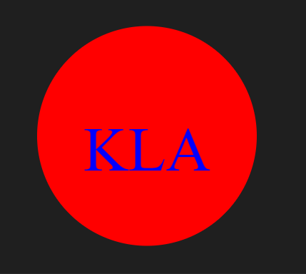
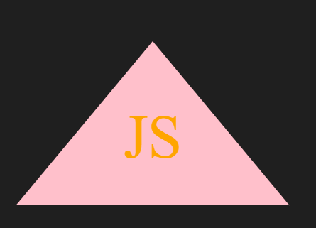
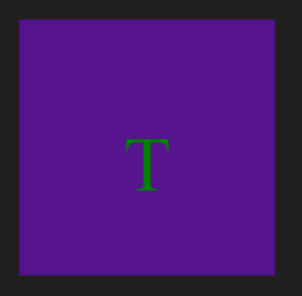
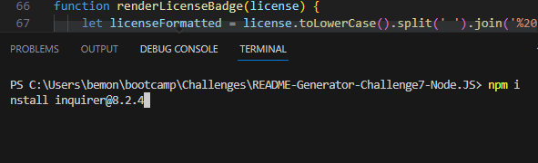

# SVG-LogoMaker-Challenge8-OOP

  ## Description
  A command line application capable of making basic svg logos tailored to specific user inputs such as letters (1-3), shape (triangle, circle and square), shape colour and text colour.
  
  
  

  ## Table of Contents
- [Installation](#installation)
- [Usage](#usage)
- [Walkthrough-Video](#walkthrough-video)
- [Contributing](#contributing)
- [Tests](#tests)
- [License](#license)
- [Questions](#Questions)
  
  ## Installation
  npm install inquirer@8.2.4 is needed to be installed to get node_modules
  
  
  ## Usage
  1. Run node index.js in the intergrated terminal.
  2. This will give the user specific prompts to generate the logo accordingly to.
  3. The logo will be generated under the name "logo.svg" in the svg format as 300x200 pixels as shown in description.
  4. Refer to [Walkthrough-Video](#walkthrough-video) for a visual guide to this.

  ## Walkthrough Video
  https://drive.google.com/file/d/17E8T8CTUgMoTymO_9gBYIbz9SwYIlQOl/view 
  
  ## Contributing
  refer to questions for ways to contact me to contribute
  
  ## Tests
  has jest installed, test by using test in intergrated console
  
  ## License
  MIT

  ## Questions
For any questions, please feel free to reach out through the following channels:
- Email: tristan2107b@gmail.com
- Github: [Bemonn](https://github.com/Bemonn)